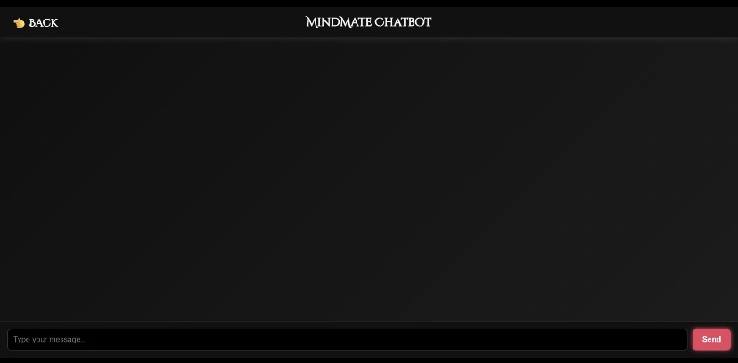
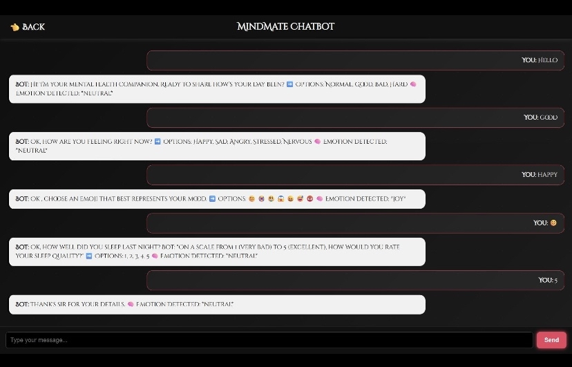
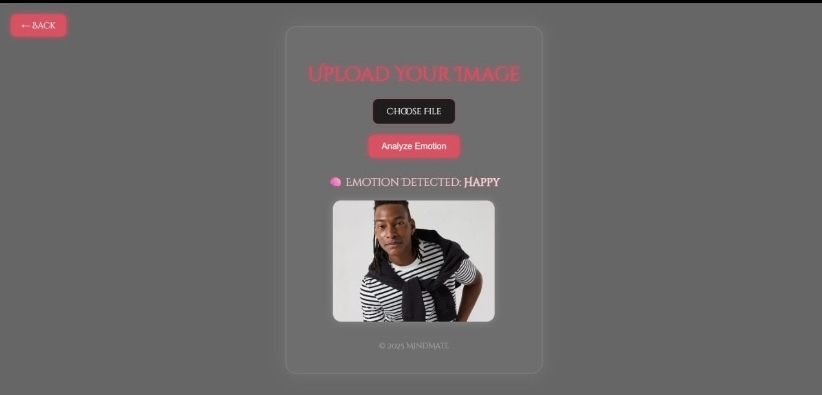
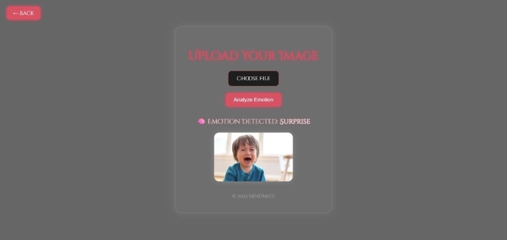
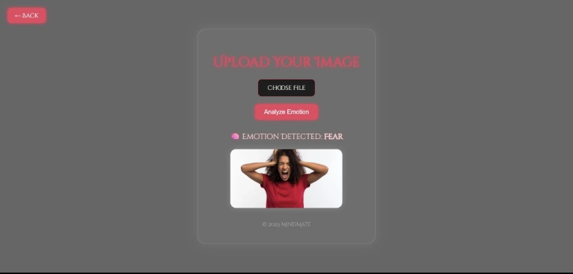

# 🧠 MindMate – Your AI-Powered Emotion Decoder

MindMate is a **web-based AI application** that reads human emotions from facial expressions using **Convolutional Neural Networks (CNN)** and integrates a **Dialogflow chatbot** to interact with users.  
It provides insights about user emotions in real-time, helping promote mental health awareness.

---

## 🎯 Features

- 🔍 **Emotion Detection** from images using CNN  
  - 7 Emotions: Angry, Disgust, Fear, Happy, Sad, Surprise, Neutral  
- 💬 **Dialogflow Chatbot** interacts with user  
  - Detects user mood based on conversation  
  - Provides adaptive responses  
- 📤 Image upload with **dynamic preview**  
- ⚡ Fast predictions with clean and modern UI  
- 🛡️ Error handling for invalid inputs  

---

## 🖼️ Visuals

### Home Page
📸 Landing page with buttons for **Chatbot** and **Image Upload**  

### Chatbot
📸 Chatbot conversation with user  

### Image Upload
📸 Upload image and preview before emotion detection  

### CNN Emotion Detection
📸 Detecting emotions from uploaded images  
 
 

---

## 🧠 Tech Stack

- **Backend:** Django  
- **Deep Learning:** TensorFlow / Keras (CNN)  
- **Chatbot:** Dialogflow  
- **Frontend:** HTML, CSS, JavaScript (Responsive UI)  
- **Computer Vision:** PIL for image preprocessing  
- **Language:** Python  

---

## 🏗️ Model Details

- **CNN Model** trained for 7-class emotion classification  
- Preprocessing includes:
  - Resizing  
  - Normalization  
- **Dialogflow chatbot** integrated to:
  - Detect mood from conversation  
  - Give context-aware responses  

---

## 📊 Learning Outcomes

- Built and trained **CNN models for emotion classification**  
- Integrated ML/DL models with Django web applications  
- Implemented image preprocessing with PIL + TensorFlow  
- Learned frontend-backend coordination for dynamic AI outputs  
- Understood **deployment challenges** and error management  

---

## 🚀 Future Improvements

- 🎥 Real-time webcam-based emotion detection  
- 📈 Train model on larger datasets for improved accuracy  
- 🧩 Integrate emotion outputs with chatbot for adaptive conversation  
- 💬 Explore transformer-based models for hybrid emotional responses  

---

## 🤖 About

MindMate is built to **promote mental health awareness through AI** by combining **image-based emotion detection** and **chatbot interaction** for real-time insights.
